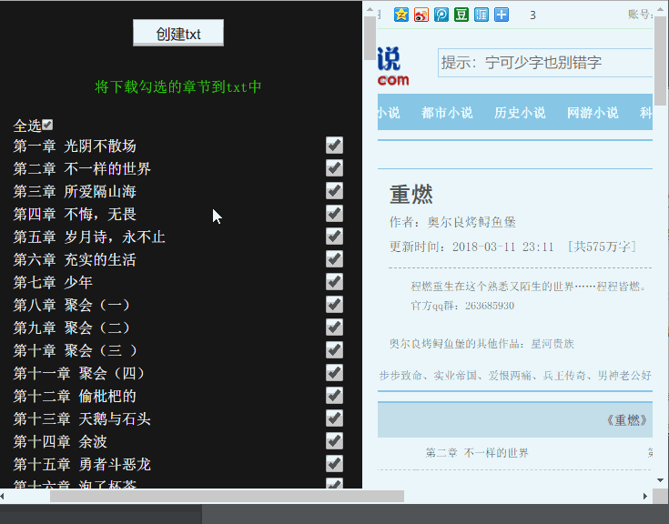

  
  <h1>book-down-read</h1>
  

    
    
    
  

  
仅在<code>Chrome 62+</code>测试使用,其他浏览器未经测试

## 使用需知

- [ ]  打开[chrome扩展页面](chrome://extensions/),勾选开发者模式,拖入.ctx文件,如需阅读本地txt请允许本地网址权限.

- [x]  (推荐)Clone or download,然后打开打开[chrome扩展页面](chrome://extensions/),勾选开发者模式,加载下载的文件夹.

## 效果

## 指南
* 下载txt

    * 下载并加载扩展
    * 点击扩展打开支持的小说网站
    * 进入小说目录页
    * 在左侧勾选下载的章节
    * 等待下载完成,点击下载

* 本地txt阅读

    * 下载完成的txt拖入浏览器
    * 右上角进行阅读设置

## 备注
通过扩展在相关页面注入js进行ajax来规避同源限制
本地阅读也是一样,在file页面加入一些代码

* 使用axios 进行ajax 
* 使用 [createObjectURL](https://developer.mozilla.org/zh-CN/docs/Web/API/URL/createObjectURL)

## 参考
[JavaScript: Create and save file](https://stackoverflow.com/questions/13405129/javascript-create-and-save-file)